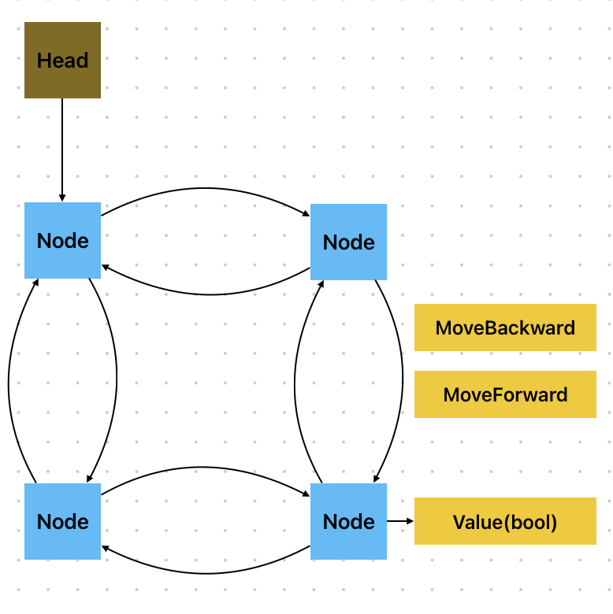
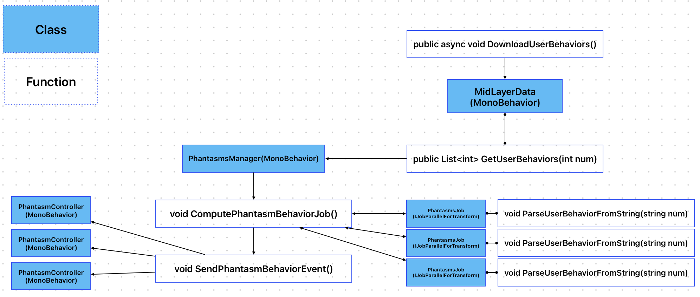

# Container Question
## Intuition
For the double-linked list and the head linked to the tail, the Diagrams look like the following diagram.


- We only have 3 public functions from `Container`  
- The size of the list is unknown.
- the value is True or False.

## Sotion
I didn't find the solution to find the size of the link via 3 public functions, but I can come up with some ideas to solve the solution

### Solution1
Get the size when generation the size, the solution only needs one more variable.

```CSharp
	if (count < 1)
	{
		var randomGen = new 		
		Random(DateTime.Now.Millisecond);
		_size = randomGen.Next(1, 9999); 
	}
```

### Solution2
Find the memory address of the head's value. we keep forwarding until the memory address is the same as the head's value, and we found the size of the container. 

### Solution3
Track the memory heap by memory debugger from Unity. The number of nodes has a linear relationship with the size, so once I know the linear equation, I know the size of the container.

# Editor Window
```CSharp
    private void OnGUI()
    {
        container = new Container();//generate the container
        if (GUILayout.Button("Add Container"))//if Add container button clicked
        {
            for (int i = 0; i < container.Size; i++)
            {
                labels.Add($"Size:{container.Size},Value:{container.Value},Index:{i+1}");//add labels text to the list
                container.MoveForward(); //move to next node
            }
        }
        if (GUILayout.Button("Clear"))
        {
            labels.Clear(); //clear label list
        }
        // Begin the scroll view
        scrollPosition = EditorGUILayout.BeginScrollView(scrollPosition);
        // Iterate over the labels list and display each label
        foreach (string label in labels)
        {
            GUILayout.Label(label);
        }
        // End the scroll view
        EditorGUILayout.EndScrollView();
    }
```

# Phantasms Question
## Intuition
- Because multiple phantasms play in the same game, we must consider the performance first, `Job System` is a good option for parallel programming. 
- We already know the players' behaviors from the `mid-layer data`, as long as we parsed phantasms' behavior, send the codes to the `phantasms controller`, and let phantasms do the action
- we don't know how many phantasms will be existed, so the `event system` will be good to tell all phantasms to do their action.

## Approach
1: Extra number of phantasms data from `mid-layer data`, we assume we already had enough phantasms' `actions data`.

2: Parse the `actions code` in `Job System`, compute what the current action should be, and modify phantasms' position parallel in the Job system.

3: Tell all phantasms computation is done by `event system`.

4: Each phantasm extra their own data from `phantasms Manager` and do actions

## Diagrams


## Action Code
Because Unity's `Job System` doesn't accept strings, the definition of action code is very important. I give an idea of how action code can be for a realistic approach.

- The `mid-layer` saved other players' action masks+positions. 

> For example, 5411122233, 111,222,333 is the position of (x,y,z), the 54 is the action mask. 54 means 110110 in binary, first bit 1 can be running, second bit 1 can be shooting, 3rd bit can be used first skill, and so on and so far. We can add as many actions as we want as long we can hold the data. We still can use 1 integer for position 1 integer for action if the integer is too small, it all depends.

- The `Job System` can compute relative actions with users if we want.

> For example, If some phantasms are 1000m away from users, we can disable these phantasms for saving hardware resources. It is all parallel, we can do as much computation as we can with action code here. 

## Extra Improvement(Experimental)
The time complexity of extra users' data and SendPhantasmBehaviorEvent is O(n), and only PhantasmJob is O(1). Extra data one by one from mid-layer and given to our Job system one by one is O(n). The event System is the same, even though it looks like 1 line code, actually delegates just stack all functions and call them one by one. As phantasms will not influence users, they can be regarded as sub-scene. In this case, we can use the DOTS system to import 10,000 phantasms without any performance issues. But the DOTS system is still developing by Unity, so it might be risky.

## Pseudocode 
### PhantasmsManager
- Only do 3 things `extra data from mid-layer`, `compute action code`, `send done event`

```CSharp
using UnityEngine;
using Unity.Collections;
using UnityEngine.Jobs;
using Unity.Jobs;
using System;

public class PhantasmsManager : MonoBehaviour
{
    public static NativeArray<int> _userBehaviorData;
    public static NativeArray<int> _phantasmsAction;
    public Vector3 _phantasmsLocation;
    public static Action EventJobComplete;
    JobHandle _jobHandle;
    PhantasmsJob _phantasmsJob;
    TransformAccessArray _transformAccessArray = new TransformAccessArray(100);
    public void Update(int index, TransformAccess transform)
    {
        _phantasmsJob = new PhantasmsJob
        {
            _userBehaviorData = _userBehaviorData,
            _phantasmsAction = _phantasmsAction,
        };
        _jobHandle = _phantasmsJob.Schedule(_transformAccessArray);
        _jobHandle.Complete();
        EventJobComplete?.Invoke();
    }
}

```

### PhantasmsJob
- The Job definition of phantasms, is parallel code, careful race condition. only `do compute the current action` and `move the position`

``` CSharp
using UnityEngine;
using Unity.Burst;
using Unity.Collections;
using UnityEngine.Jobs;
using System.Collections.Generic;

[BurstCompile]
public struct PhantasmsJob : IJobParallelForTransform
{
    public NativeArray<int> _userBehaviorData;
    public NativeArray<int> _phantasmsAction;
    public Vector3 _phantasmsLocation;
    public void Execute(int index, TransformAccess transform)
    {
        ParseUserBehaviorFromString(index, transform);
    }
    void ParseUserBehaviorFromString(int index, TransformAccess transform)
    {
        //after complex parse....
        //Got users position
        Vector3 position = new Vector3(0, 0, 0); //can be ....
        //Got users' actions
        int actions = 25; // can be....
        //set this user's position(we can do parallel in Job system)
        transform.position = position;
        //save the action code
        _phantasmsAction[index] = actions;
    }
}
```

### PhantasmController
- Only `do action` by the action code once received the Job Computation done

```CSharp
using UnityEngine;
using Unity.Collections;
using UnityEngine.Jobs;
using Unity.Jobs;

public class PhantasmController : MonoBehaviour
{
    //....
    int Index;
    void OnEnable()=>PhantasmsManager.EventJobComplete += DoSomeActions;

    void OnDisable()=>PhantasmsManager.EventJobComplete -= DoSomeActions;
    void DoSomeActions()
    {
        //....
        //PhantasmsManager._phantasmsAction[index];
        //PhantasmsManager.__phantasmsAction[index];
    }
}

```

